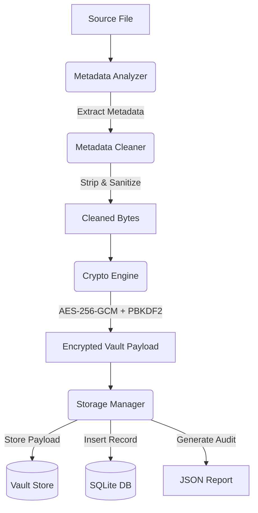

# Secure File Vault (SecureVault)

[](#license)
[](https://python.org)
[](#usage)
[](#security-specifications)
[](#metadata-cleaning-details)
[](#automated-testing)

SecureVault is a high-integrity desktop application designed to counter metadata privacy leaks. It automatically parses files (Images, PDFs, DOCX), detects and strips identifying metadata, encrypts the sanitized payloads using AES-256-GCM, and archives them securely. 

Every ingestion creates a local database record and a tamper-evident audit report containing SHA-256 cryptographic hashes for forensic validation.

---

## 🏗️ Architecture & Workflow



---

## ✨ Features

- **Batch & Recursive File Processing:** Ingest single files or scan entire directories recursively.
- **Selective Metadata Extraction & Stripping:**
  - **Images (JPEG, PNG):** Removes all EXIF metadata tags.
  - **PDFs:** Purges document info fields (Author, Creator, Title, etc.), XMP metadata streams, and unique document IDs.
  - **DOCX:** Deconstructs the document ZIP archive, rewrites the core metadata XML files (`core.xml` and `app.xml`) with neutral, empty templates, and rebuilds the container safely.
- **Strong Cryptographic Protection:** Derives master keys dynamically via PBKDF2 with 200,000 iterations of SHA-256 and encrypts payloads with authenticated AES-256-GCM.
- **Data Integrity & Auditability:** Generates SHA-256 checksums at every phase (original, stripped, and encrypted) and writes them to a local JSON verification audit report.
- **Unified Interfaces:** Offers both a graphical user interface (Tkinter desktop app) and a command-line interface.

---

## 🔒 Security Specifications

| Attribute | Implementation Standard | Details |
| :--- | :--- | :--- |
| **Encryption Algorithm** | AES-256-GCM | Authenticated symmetric encryption with a 96-bit random nonce |
| **Key Derivation (KDF)** | PBKDF2HMAC | 200,000 hashing iterations using SHA-256 and a random 128-bit salt |
| **Integrity Checks** | SHA-256 | Cryptographic verification of original, stripped, and ciphered bytes |
| **Storage Separation** | Vault Directory | Encrypted payloads are archived separately; salts & nonces are stored as DB blobs |

---

## 🚀 Getting Started

### Prerequisites
- Python 3.10 or higher
- Pip (Python Package Installer)

### Installation
1. Clone or download the repository contents to a local workspace.
2. Install the required dependencies:
   ```bash
   pip install -r requirements.txt
   ```

---

## 🛠️ Usage

### 🖥️ Desktop GUI Interface
Launch the graphical UI for visual file selection, real-time metadata previews, and simple restoration:
```bash
python gui_app.py
```

### 💻 Command Line Interface (CLI)

#### 1. Ingest / Secure a File
Strips the metadata, encrypts the file, and registers it in the local database:
```bash
python app.py ingest --path <file_or_folder_path> --passphrase <your_passphrase>
```
*Example:*
```bash
python app.py ingest --path examples/sample.JPG --passphrase "SuperSecretPassword123"
```

#### 2. Restore / Decrypt a File
Decrypts the secured payload by its unique database record ID and exports the clean file:
```bash
python app.py restore --id <record_id> --passphrase <your_passphrase> --out <output_directory>
```
*Example:*
```bash
python app.py restore --id 1 --passphrase "SuperSecretPassword123" --out restored_files
```

#### 3. View Ingested History
View vault logs, original names, and timestamps formatted in a command-line table:
```bash
python view_db.py
```

---

## 🧪 Automated Testing

SecureVault features an automated test suite that validates the complete lifecycles of encryption, decryption, metadata removal, and database mapping.

Run the test suite using `pytest`:
```bash
python -m pytest tests/
```

---

## 📄 License
This project is licensed under the MIT License. See the [LICENSE](LICENSE) file for more information.
